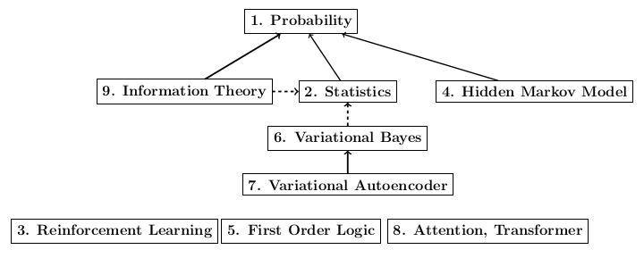

# beginner_to_intermediate_AI

## [approx] Prerequisite Graph

## Links
<table class="c4"><tbody><tr class="c6"><td class="c0" colspan="1" rowspan="1">
Topic
</td><td class="c0" colspan="1" rowspan="1">
Link
</td><td class="c0" colspan="1" rowspan="1">
Description
</td><td class="c0" colspan="1" rowspan="1">
Prerequisite</sspan>
</td></tr><tr class="c6"><td class="c0" colspan="1" rowspan="1">
1.Probability
</td><td class="c0" colspan="1" rowspan="1">
<a class="c5" href="https://www.google.com/url?q=https://www.youtube.com/playlist?list%3DPLUl4u3cNGP61MdtwGTqZA0MreSaDybji8&amp;sa=D&amp;source=editors&amp;ust=1621135918997000&amp;usg=AOvVaw3AhdGz2hXV2Zx7UsOz4deV">YT playlist</a>
</td><td class="c0" colspan="1" rowspan="1">
MIT 6.041 Probabilistic Systems Analysis and Applied Probability, Fall 2010
</td><td class="c0" colspan="1" rowspan="1">
taken for granted
</td></tr><tr class="c6"><td class="c0" colspan="1" rowspan="1">
2.Statistics
</td><td class="c0" colspan="1" rowspan="1">
<a class="c5" href="https://www.google.com/url?q=https://www.youtube.com/playlist?list%3DPLUl4u3cNGP60uVBMaoNERc6knT_MgPKS0&amp;sa=D&amp;source=editors&amp;ust=1621135918998000&amp;usg=AOvVaw1S_BT_tU6kcgr4VHJf-LmA">YT playlist</a>
</td><td class="c0" colspan="1" rowspan="1">
MIT 18.650 Statistics for Applications, Fall 2016
</td><td class="c0" colspan="1" rowspan="1">
Probability
</td></tr><tr class="c6"><td class="c0" colspan="1" rowspan="1">
4.Hidden Markov Model
</td><td class="c0" colspan="1" rowspan="1">
<a class="c5" href="https://www.google.com/url?q=https://www.youtube.com/watch?v%3DjY2E6ExLxaw&amp;sa=D&amp;source=editors&amp;ust=1621135919000000&amp;usg=AOvVaw1nHwB_3tKPsF-Ngrwa4YfW">YT lecture</a>
</td><td class="c0" colspan="1" rowspan="1">
A lecture of Undergraduate Machine Learning at UBC by Nando de Freitas, 2012
</td><td class="c0" colspan="1" rowspan="1">
Probability: Bayes Theorem
</td></tr><tr class="c6"><td class="c0" colspan="1" rowspan="1">
6.Variational Bayes
</td><td class="c0" colspan="1" rowspan="1">
<a class="c5" href="https://www.google.com/url?q=https://www.youtube.com/playlist?list%3DPLxC_ffO4q_rW_8Fflob7SuMwpjlSh5f5K&amp;sa=D&amp;source=editors&amp;ust=1621135919001000&amp;usg=AOvVaw1DmF62feFOukts2J2sMTrw">YT playlist</a>

<a class="c5" href="https://www.google.com/url?q=https://people.csail.mit.edu/tbroderick/tutorials.html&amp;sa=D&amp;source=editors&amp;ust=1621135919002000&amp;usg=AOvVaw0h218JHApm9oft4EDRcMaA">Slides</a>
</td><td class="c0" colspan="1" rowspan="1">
Lecture series of Tamara Broderick from MIT
</td><td class="c0" colspan="1" rowspan="1">
Probability: Bayesian inference

Statistics: KL divergence(optional)
</td></tr><tr class="c6"><td class="c0" colspan="1" rowspan="1">
7.Variational Autoencoder
</td><td class="c0" colspan="1" rowspan="1">
<a class="c5" href="https://www.google.com/url?q=https://www.youtube.com/watch?v%3DuaaqyVS9-rM&amp;sa=D&amp;source=editors&amp;ust=1621135919003000&amp;usg=AOvVaw1vA7H-UwHZtDTGE4Jwb9GI">YT lecture</a>
</td><td class="c0" colspan="1" rowspan="1">
Ali Ghodsi Deep Learning lecture, University of Waterloo
</td><td class="c0" colspan="1" rowspan="1">
Variational Bayes, KL divergence
</td></tr><tr class="c6"><td class="c0" colspan="1" rowspan="1">
3.Reinforcement Learning
</td><td class="c0" colspan="1" rowspan="1">
<a class="c5" href="https://www.google.com/url?q=https://www.youtube.com/watch?v%3DO5hkIfUR_uA&amp;sa=D&amp;source=editors&amp;ust=1621135919005000&amp;usg=AOvVaw0VaewXwcFco130r2Z8f8q9">State machines and Markov decision processes</a>

<a class="c5" href="https://www.google.com/url?q=https://www.youtube.com/watch?v%3DIr93m9OmOHo&amp;sa=D&amp;source=editors&amp;ust=1621135919005000&amp;usg=AOvVaw27BeKxm-7boRy5ZTJGbBMC">Reinforcement learning</a>
</td><td class="c0" colspan="1" rowspan="1">
MIT 6.036 Machine Learning Fall 2020, by Tamara Broderick
</td><td class="c0" colspan="1" rowspan="1">
Taken for granted
</td></tr><tr class="c6"><td class="c0" colspan="1" rowspan="1">
8.Attention, Transformer
</td><td class="c0" colspan="1" rowspan="1">
<a class="c5" href="https://www.google.com/url?q=https://www.youtube.com/watch?v%3DOyFJWRnt_AY&amp;sa=D&amp;source=editors&amp;ust=1621135919006000&amp;usg=AOvVaw2LSAAJlzkcJQZuLO3Af4pv">YT lecture</a>
</td><td class="c0" colspan="1" rowspan="1">
CS 460/680, Intro to ML, Pascal Poupart
</td><td class="c0" colspan="1" rowspan="1">
Taken for granted
</td></tr><tr class="c6"><td class="c0" colspan="1" rowspan="1">
9.Information Theory
</td><td class="c0" colspan="1" rowspan="1">
<a class="c5" href="https://www.google.com/url?q=https://www.youtube.com/watch?v%3DVhhNcmPLKgo%26list%3DPLp6ek2hDcoNBtaNoXzFE3BYKNZ2kUJo1f%26index%3D2&amp;sa=D&amp;source=editors&amp;ust=1621135919008000&amp;usg=AOvVaw1NecRbJeD3Kket6GhTg8bn">Introduction to Information Theory</a>

<a class="c5" href="https://www.google.com/url?q=https://www.youtube.com/watch?v%3D98BAo8L-o6s%26list%3DPLp6ek2hDcoNBtaNoXzFE3BYKNZ2kUJo1f%26index%3D3&amp;sa=D&amp;source=editors&amp;ust=1621135919009000&amp;usg=AOvVaw15yX3nphNOXkesODg3gWhV">Entropy, Mutual Information, Conditional and Joint Entropy</a>

<a class="c5" href="https://www.google.com/url?q=https://www.youtube.com/watch?v%3D-pHUIQ0sDqA&amp;sa=D&amp;source=editors&amp;ust=1621135919009000&amp;usg=AOvVaw0YGOwTBj6NMLNLF_tul03X">Measures for Continuous, Random Variable, Relative Entropy</a>
</td><td class="c0" colspan="1" rowspan="1">
First three lectures of Information Theory, Coding and Cryptography, offered by IIT, Delhi
</td><td class="c0" colspan="1" rowspan="1">
Probability

KL divergence (optional)
</td></tr></tbody></table>